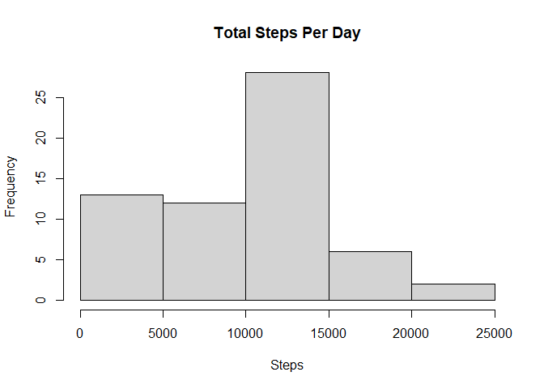

## Loading and preprocessing data


```r
unzip("activity.zip")
activity <- read.csv("activity.csv")
activity$date <- as.Date(activity$date, "%Y-%m-%d")

head(activity)
```

```
##   steps       date interval
## 1    NA 2012-10-01        0
## 2    NA 2012-10-01        5
## 3    NA 2012-10-01       10
## 4    NA 2012-10-01       15
## 5    NA 2012-10-01       20
## 6    NA 2012-10-01       25
```
Unzipping and loading the data into activity, then formatting the Date column into a date class instead of a character string.

## Mean total number of steps per day

First, I group Activity by the date. Then, using summarize, I create a new column of the total steps by date and save this to a new frame, Sums


```r
sums <-activity %>%
  group_by(date) %>%
  summarize(steps = sum(steps, na.rm = T))
```

```
## `summarise()` ungrouping output (override with `.groups` argument)
```

```r
sums
```

```
## # A tibble: 61 x 2
##    date       steps
##    <date>     <int>
##  1 2012-10-01     0
##  2 2012-10-02   126
##  3 2012-10-03 11352
##  4 2012-10-04 12116
##  5 2012-10-05 13294
##  6 2012-10-06 15420
##  7 2012-10-07 11015
##  8 2012-10-08     0
##  9 2012-10-09 12811
## 10 2012-10-10  9900
## # ... with 51 more rows
```
Using the dataframe shown above, I create a histogram of the total number of steps per day.

<!-- -->
  

Then, I calculate the mean and median of the total number of steps taken per day, which come out to be


```
## [1] "Mean: 9354.22950819672"
```

```
## [1] "Median: 10395"
```

## Average Daily Activity Pattern

I once again use group_by() and summarize() to apply the average function on the number of steps from each time interval. The function is set to ignore NAs.


```r
AvgStepsByInterval <-activity %>%
  group_by(interval) %>%
  summarize(steps = mean(steps, na.rm = T))
```

```
## `summarise()` ungrouping output (override with `.groups` argument)
```

```r
head(AvgStepsByInterval)
```

```
## # A tibble: 6 x 2
##   interval  steps
##      <int>  <dbl>
## 1        0 1.72  
## 2        5 0.340 
## 3       10 0.132 
## 4       15 0.151 
## 5       20 0.0755
## 6       25 2.09
```

After configuring the data, I make the time series plot using the plot() function. The X axis is the time interval and the Y axis is the average number of steps taken across all days at each time interval.

<!-- -->

  
The AvgStepsByInterval frame is indexed by the index of the maximum number of steps in the frame (identified using which.max()) to find the 5-minute interval during which the number of average steps is maximized. 


```r
AvgStepsByInterval[which.max(AvgStepsByInterval$steps),]$interval
```

```
## [1] 835
```
## Inputting missing values

The number of rows where the step is NA is calculated using sum() over the logical list returned by is.na.


```r
sum(is.na(activity$steps))
```

```
## [1] 2304
```
The missing values in the dataset are replaced with the median for that five-minute interval. 


```r
m<- mapply(function(x,y)
  if(is.na(x)){x <- AvgStepsByInterval[AvgStepsByInterval$interval == y, 2]}
  else{
    x <- x
  }, activity$steps, activity$interval, USE.NAMES = FALSE, SIMPLIFY = T)

filled_activity <- activity
filled_activity$steps<-unlist(unname(m))

head(filled_activity)
```

```
##       steps       date interval
## 1 1.7169811 2012-10-01        0
## 2 0.3396226 2012-10-01        5
## 3 0.1320755 2012-10-01       10
## 4 0.1509434 2012-10-01       15
## 5 0.0754717 2012-10-01       20
## 6 2.0943396 2012-10-01       25
```

The new dataset is set as filled_activity. 

filled_activity is grouped by day and the sum() function is applied with summarize to find the total number of steps on each day. Then, this is graphed on a histogram.


```
## `summarise()` ungrouping output (override with `.groups` argument)
```

<!-- -->
  
The mean and median of this data is shown below.


```
## [1] "Mean: 10766.1886792453"
```

```
## [1] "Median: 10766.1886792453"
```

The middle bar of the histogram is significantly higher than the dataset in which the values are not filled. The mean is also much higher, since the mean but the median was only a little larger.

Imputing missing data added points to the data that was larger than the smallest data points and smaller than the largest data points, as seen in the histogram, which saw the greatest rise in the middle bar. As many of the values are small, with some larger outliers, this increased the average and shifted the median higher.

## Weekdays vs Weekends

To compare the data from weekdays vs weekends, a new column is added to filled_activity, categorizing the observations by weekend or weekday. 


```r
filled_activity$day <- sapply(filled_activity$date, function(x) 
  if(weekdays(x) == "Saturday"|weekdays(x) == "Sunday" ){
    y<- "Weekend"
  }
  else{
    y<- "Weekday"
  })

head(filled_activity)
```

```
##       steps       date interval     day
## 1 1.7169811 2012-10-01        0 Weekday
## 2 0.3396226 2012-10-01        5 Weekday
## 3 0.1320755 2012-10-01       10 Weekday
## 4 0.1509434 2012-10-01       15 Weekday
## 5 0.0754717 2012-10-01       20 Weekday
## 6 2.0943396 2012-10-01       25 Weekday
```
The average of the steps during each interval was calculated for each type of day and saved as filled_mean.


```r
filled_mean<-filled_activity %>%
  group_by(day, interval)%>%
  summarize(average= mean(steps))
```

```
## `summarise()` regrouping output by 'day' (override with `.groups` argument)
```

```r
head(filled_mean)
```

```
## # A tibble: 6 x 3
## # Groups:   day [1]
##   day     interval average
##   <chr>      <int>   <dbl>
## 1 Weekday        0  2.25  
## 2 Weekday        5  0.445 
## 3 Weekday       10  0.173 
## 4 Weekday       15  0.198 
## 5 Weekday       20  0.0990
## 6 Weekday       25  1.59
```

filled_mean was then used to generate a two graphs of the average steps at each interval, separated by the type of day. 


```r
g<- ggplot(filled_mean)
g+ facet_wrap(.~day, nrow = 2) + geom_line(aes(interval, average)) + labs(title = "Average Steps at Each Interval by Type of Day") + labs(x = "Interval", y = "Average")
```

<!-- -->
